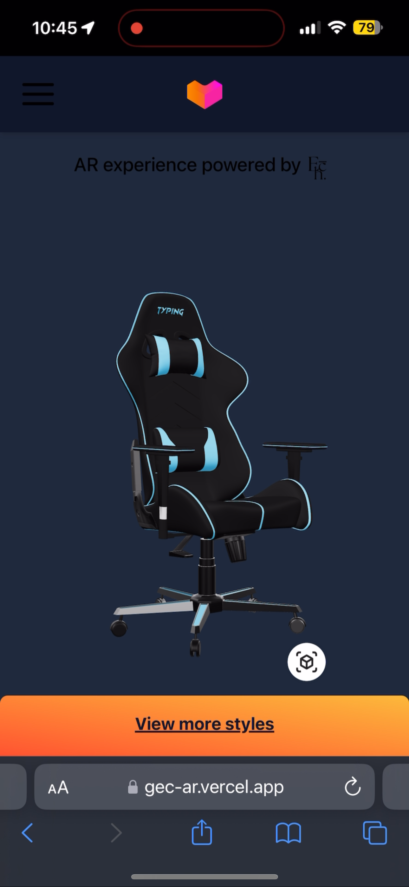
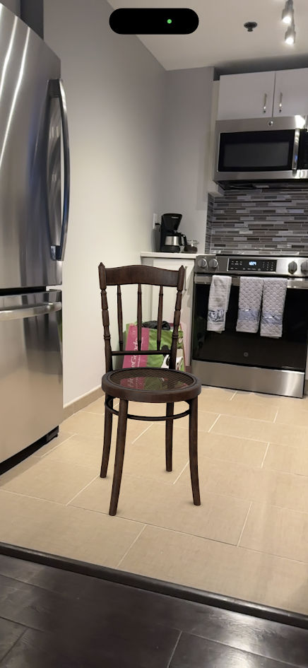

# GEC AR Ecommerce Prototype

This React app uses Augmented Reality (AR) to let users view and compare online shopping products in the real world by using before purchasing them. The prototype is part of The Echelon Group's pitch for [Alibaba's 2024 Global E-Commerce Challenge](https://aidc-jobs.alibaba.com/GEC/index/program).

## Try It Out!

Visit [gec-ar.vercel.app](gec-ar.vercel.app) to try it out for yourself!

    
    

Note: a mobile device with AR support is required to access the site's full functionality.

## Developer Instructions

### Getting Started
1. Clone the repository and ensure Node.js and npm are installed on your device.
2. Next, <code>cd</code> into the project directory and run the following commands from your terminal: \
<code>$ npm install</code> \
<code>$ npm start</code>
3. You should now be able to access the site at [http://localhost:3000/](http://localhost:3000/).
